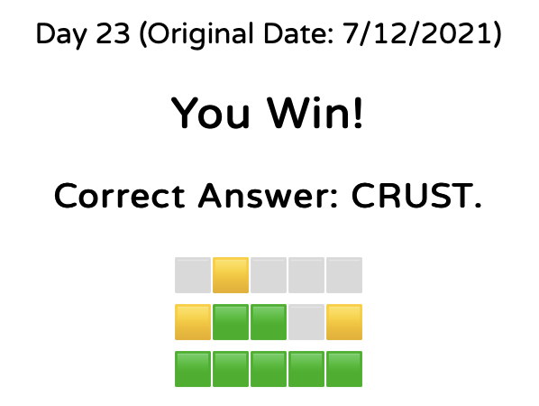

# wSolver

This is a quick hack I put together to solve wordle games

### Usage

Since this was put together as a real hack, there isn't a lot of UI to it.  You edit
code and run between guesses in your game

Around line 50 in the playground, there are these variables:
https://github.com/jcmendez/wSolver/blob/5a8ca5ed87ffa340645053cefd94c4701b60c4e8/MyPlayground.playground/Contents.swift#L50

```
let greenLettersPattern = "FRE.."
yellowGuesses = [".*E.*"]
yellowDiscards = ["....[^E]"]
grayLetters = ["I","A","T","O","N"]
```

This is where changes are made.  I'll solve https://metzger.media/games/wordle-archive/?day=23 and chose
to start with OUIJA.
The U comes yellow, rest of words gray, so I change the code as follows

```
let greenLettersPattern = "....."
yellowGuesses = [".*U.*"]
yellowDiscards = [".[^U]..."]
grayLetters = ["O","I","J","A"]
```

Run the code and the result is a long array that starts:
```
["TRUES", "UNSET", "ERUCT", "CRUET", "TRUCE", "TRUED", 
```

That array is the probability-sorted list of words that meet the constraints.

Sometimes the aspell dictionary has something that isn't a valid word for wordle, if that's the case
go with the next one.  Going on the wordle page, entering TRUES, I get: yellow T, green R and U, gray E
and yellow S.  The code is now edited as:

```
let greenLettersPattern = ".RU.."
yellowGuesses = [".*U.*",".*T.*",".*S.*"]
yellowDiscards = [".[^U]...","[^T]....","....[^S]"]
grayLetters = ["O","I","J","A","E"]
```

Run again:
```
["CRUST"]
```


Boom.

